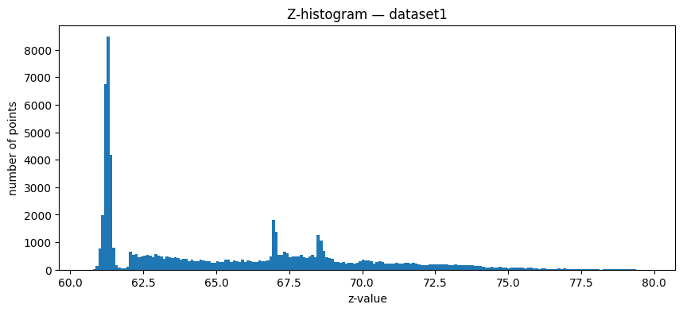
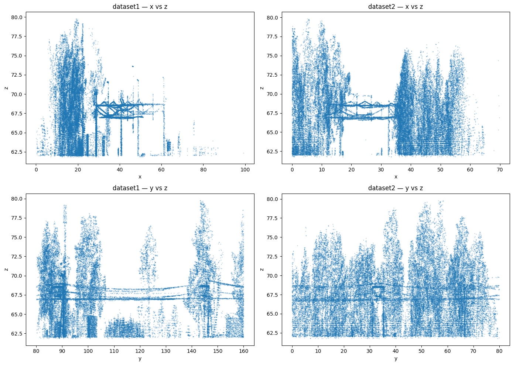
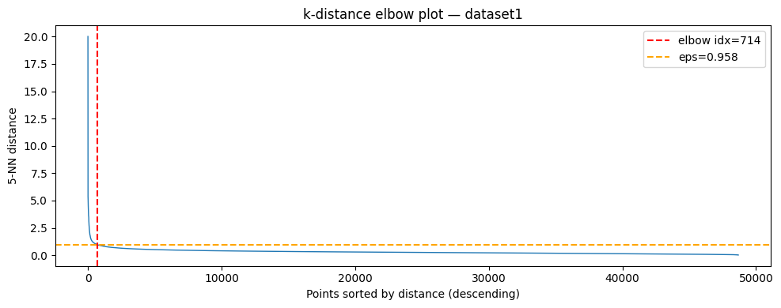
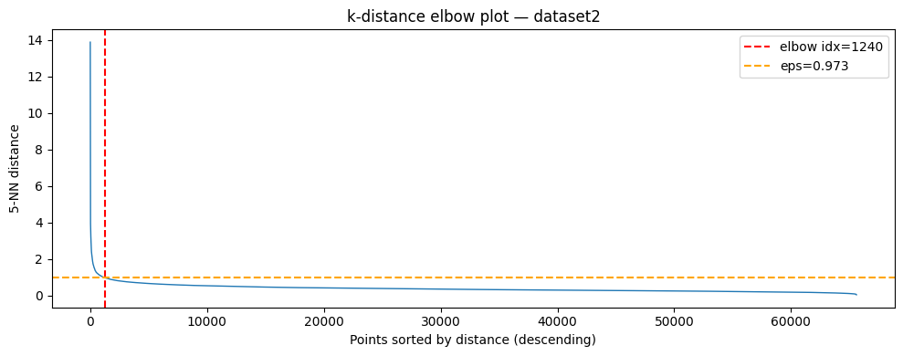
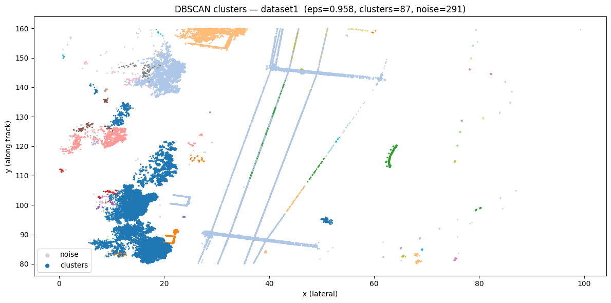
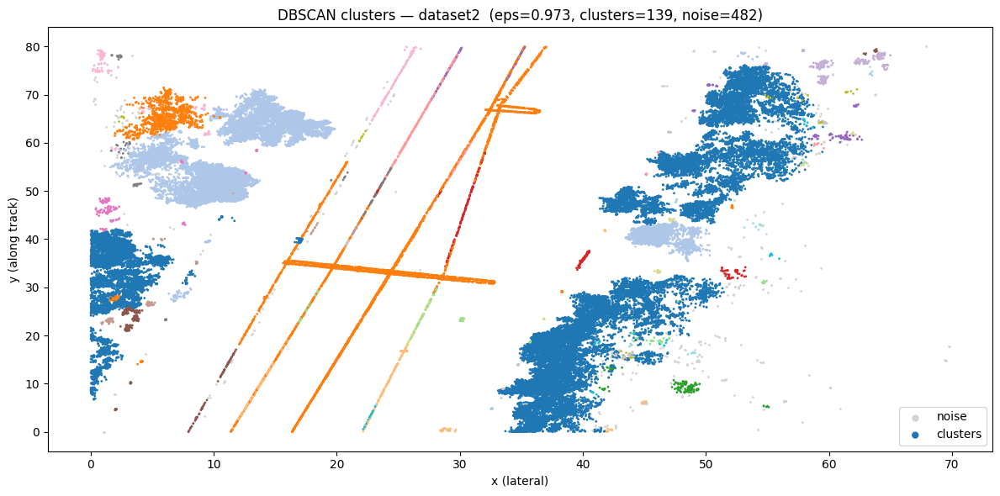
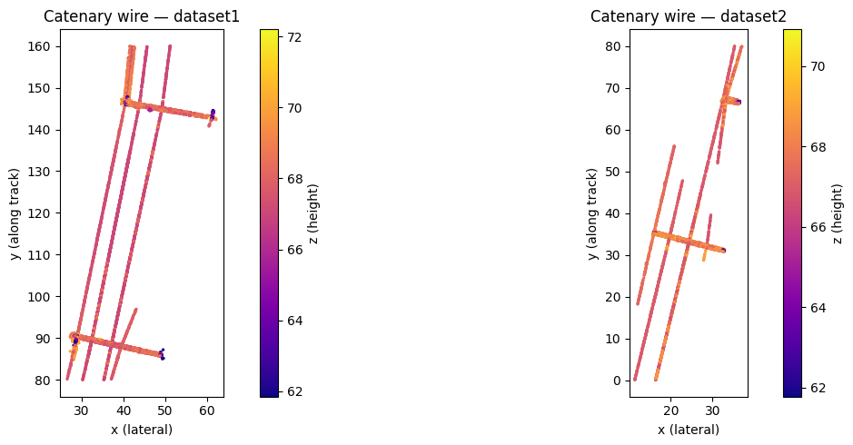

# Assignment 5 — LiDAR Catenary Detection

Processing semi-processed LiDAR point cloud data from a railway corridor to detect the catenary (overhead contact wire).

---

## Task 1 — Ground level detection

Ground level was found using a histogram of z-values. The peak bin indicates the ground plane; the ground level threshold is set just above that peak.

| Dataset  | Ground level (m) |
|----------|-----------------|
| dataset1 | 61.85           |
| dataset2 | 61.77           |

### Histogram — dataset1

### Histogram — dataset2

---

## Task 2 — Optimal DBSCAN eps

The optimal eps was found using the k-distance elbow method (k=5). The distance to the 5th nearest neighbor is sorted and plotted; the elbow point is detected geometrically as the point furthest from the line connecting the curve's endpoints.

| Dataset  | Optimal eps | Clusters | Noise points |
|----------|-------------|----------|--------------|
| dataset1 | 0.958       | 87       | 291          |
| dataset2 | 0.973       | 139      | 482          |

### Elbow plot — dataset1

### Elbow plot — dataset2

### Cluster plot — dataset1

### Cluster plot — dataset2

---

## Task 3 — Catenary wire identification

The catenary wire was identified as the cluster with the largest combined x+y span, excluding the noise cluster (label = −1). The catenary runs the full length of the track section, giving it a dominant y-span compared to all other clusters.

| Dataset  | min(x) | max(x) | min(y) | max(y) |
|----------|--------|--------|--------|--------|
| dataset1 | 26.50  | 62.14  | 80.02  | 159.96 |
| dataset2 | 11.39  | 37.01  | 0.04   | 79.98  |

The two datasets cover the same corridor end to end: dataset1 spans y = 80–160 m and dataset2 spans y = 0–80 m.

### Catenary cluster plot

